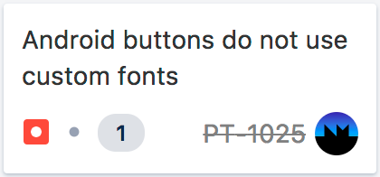

# Measure a custom component in React Native on Android
July 2017

I recently embarked on a phased journey of frustration, leading more frustration and finally understanding. That journey started at the, all too common, realisation that the React Native (RN) library we were using had limited Android support. We were using [react-native-svg](https://github.com/react-native-community/react-native-svg) to produce a rounded button with a linear gradient applied to the outline stroke and inner text label. Much like the one below;


The button uses a custom typeface and that was the limitation. The library did not support custom fonts for text nodes on Android. At the time, this was a [logged issue](https://github.com/react-native-community/react-native-svg/issues/189), but no solution or work-around.

So, the app was shipped despite the deviation from the designs and a bug was placed on the backlog. A fix was estimated at 1 day (yes, we estimate in time rather than story points).



The technical solution selected was to implement a custom native UI component guided by the detailed and all-encompassing [official documentation](https://facebook.github.io/react-native/docs/native-components-android.html) on the subject. A guide which I have used before with adequate success. But, this time would be different.

Previously, our custom components have been laid out and sized by Flex. In these cases the width and height of the component are static or derived from the Flex layout process. Either way, the native View is given hard dimensions and can simply draw to the canvas provided. Simple.

Not so simple when you want to draw text of dynamic length and font metrics. In this case the native View needs to provide an indication of required size to RN during the Flex measurement runs. Much like the measurement system in Android itself.

One therefore might assume that simply overriding [`View.onMeasure()`](https://developer.android.com/reference/android/view/View.html#onMeasure(int, int)) in ones custom View might do the trick. Indeed it does not. The size constraints provided by whatever RN parent are [`MeasureSpec.EXACTLY`](https://developer.android.com/reference/android/view/View.MeasureSpec.html#EXACTLY) provided, and deviation from this has no affect. The example below demonstrates this behaviour.

**React component**:

```javascript
class App extends React.Component<{}, undefined> {
  render() {
    return (
      <View
        style={{
          flex: 1,
        }}>

        <CustomComponent />
      
      </View>
    )
  }
}
```

**Android view:**

```java
public class CustomComponent extends View {
    @Override
    protected void onMeasure(int widthMeasureSpec, int heightMeasureSpec) {
        super.onMeasure(widthMeasureSpec, heightMeasureSpec);
        
        Log.d("CustomComponent", "Width: " + MeasureSpec.getSize(widthMeasureSpec));
        Log.d("CustomComponent", "Width mode: " + measureSpecModeToString(widthMeasureSpec));
        Log.d("CustomComponent", "Height: " + MeasureSpec.getSize(heightMeasureSpec));
        Log.d("CustomComponent", "Height mode: " + measureSpecModeToString(heightMeasureSpec));
    }
}
```

**Output:**

```
07-26 08:50:56.745 4534-4534/com.parktechnology.tuk.dev D/CustomComponent: Width: 1080
07-26 08:50:56.745 4534-4534/com.parktechnology.tuk.dev D/CustomComponent: Width mode: 1073741824 (aka MeasureSpec.EXACTLY)
07-26 08:50:56.745 4534-4534/com.parktechnology.tuk.dev D/CustomComponent: Height: 0
07-26 08:50:56.745 4534-4534/com.parktechnology.tuk.dev D/CustomComponent: Height mode: 1073741824 (aka MeasureSpec.EXACTLY)
```

This indicates that the size of our custom component has already been decided prior to the attaching, measuring and drawing of our custom view. This is where the frustration phase of this journey begins. At the time, I was unable to find any documentation detailing how the RN measurement system works and how to properly measure my custom view. Previous investigations revealed RN uses [Yoga](https://facebook.github.io/yoga/docs) as its Flexbox implementation.

Yoga is a cross-platform layout engine supporting Java/Android and objC/Swift (among others). The [concise doc](https://facebook.github.io/yoga/docs/api/java/) contain a section titled ‘Custom measurements’ which further support the suspicion of a behind-the-scenes measurement and layout system. Still no reference to how this might work in RN.

With the lack of available documentation, no luck finding existing StackOverflow questions and no obvious API to fumble through, I was left with one remaining approach - read the source code. I started with the built in Text and Image components. Both measure themselves based on their content when they are used in a Flex parent.

I stumbled upon `Text.js` in my node_modules folder which provides the `<Text />` class. Internally this class binds to `RCTText` which is the native component. This component is managed by ReactTextViewManager.java (for Android). This is where the `@ReactProps` are registered and where the native view class instances are created. This is done in the `ViewManager.createViewInstance` method and is in keeping with RN’s documentation on the [matter](https://facebook.github.io/react-native/docs/native-components-android.html). Scrolling much further down this class I noticed another overridden method -`ViewManager.getShadowNodeClass`. This returns a `ReactShadowNode` the JavaDoc for which reads;

>Base node class for representing virtual tree of React nodes. Shadow nodes are used primarily for layouting therefore it extends YogaNode to allow that.

Ignoring the questionable English, this provides the first glimpse of the link between RN and Yoga. It also begins to explain that the layout and measurement happens outside of the native view implementation. Now we are getting somewhere. This is the understanding phase.

The RN text component has a custom implementation aptly called `ReactTextShadowNode` which extends `LayoutShodowNode` and eventually extends `ReactShadowNode`. The method `ReactShadowNode.setMeasureFunction` is how you provide custom measurement logic and accepts an implementation of interface `YogaMeasureFunction`. Here’s an example;

```java
public class GradientTextShadowNode extends LayoutShadowNode implements YogaMeasureFunction {
    public GradientTextShadowNode() {
        this.setMeasureFunction(this);
    }

    @Override
    public long measure(
      YogaNode node,
      float width, YogaMeasureMode widthMode,
      float height, YogaMeasureMode heightMode) {
      return YogaMeasureOutput.make(0, 0);
    }
}
```

I’ve used `LayoutShadowNode` (sub class of `ReactShadowNode`) as this handles common flex layout and style properties. Notice the use of `YogaMeasureOutput.make(int width, int height)` to package up our measured dimensions into a long before returning. All that’s left is to perform your custom measurement. In order to do this you are likely going to need to know more about the content you will be rendering, such as the text and font or the image source as examples.

To catch these properties you add methods decorated with `@ReactProp` in an almost identical way to how `ViewManagers` work. Except `ReactShadowNodes` are not passed a reference to a view instance. Heres an example;

```java
@ReactProp(name = "font")
public void setFont(@Nullable String filename) {
    // Grab the font metrics (or something)
    dirty();
}
```

Use these methods to perform any pre-measurement calculations or simply update your member variables with the new properties. Make sure to call `ReactShadowNode.dirty` to tell the framework that your node needs to be re-measured. This will cause a call to your YogaMeasureFunction.measure implementation. Simple when you know how.

So, a task that was estimated at 1 day consumed 4.5 days of my valuable time. I’m glad to have gained this insight and I hope my finding help eliviate some pain for others.